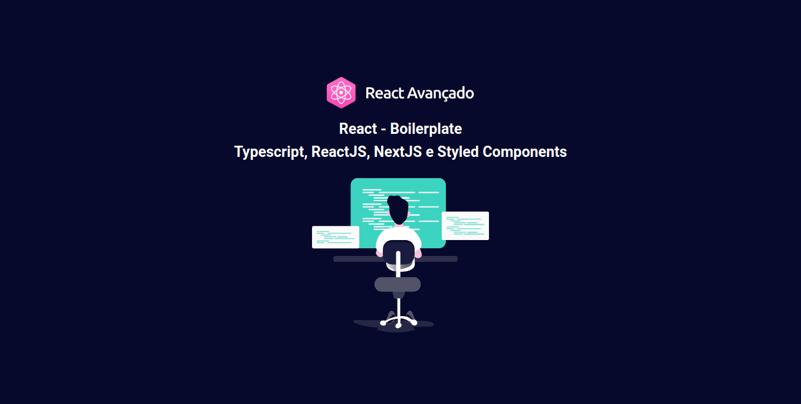

# Boilerplate NextJS
<p>A default configuration of an application with NextJS</p>



## Technologies used
  - [NextJS](https://nextjs.org)
  - [Typescript](https://www.typescriptlang.org)
  - [Styled Components](https://www.styled-components.com)

## Config used
  - [Eslint](https://eslint.org)
  - [Husky](https://typicode.github.io/husky/#/)
  - [Lint Staged](https://github.com/okonet/lint-staged)
  - [Jest](https://jestjs.io)
  - [Testing Library React](https://testing-library.com/docs/react-testing-library/intro/)
  - [Editor Config](https://editorconfig.org/)
  - [PWA](https://web.dev/progressive-web-apps/)

## Getting Started

First, install all dependencies:

```bash
yarn install
```

Second, run the development server:

```bash
yarn dev
```

Open [http://localhost:3000](http://localhost:3000) with your browser to see the result.

